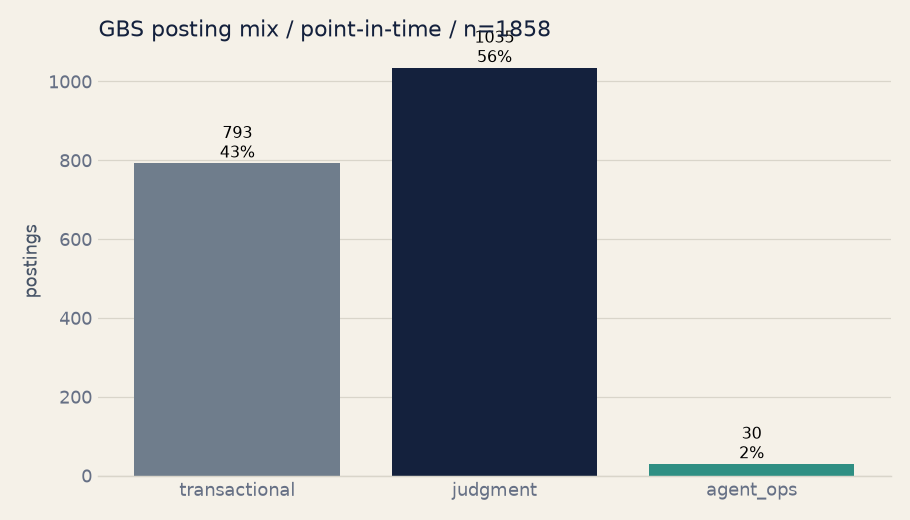

# Results

**Generated:** 2026-08-15  **Scope:** live Adzuna postings, point-in-time cross-section

Cross-section of **2159** labelled live GBS / finance-operations postings (adzuna/ch, adzuna/de, adzuna/es, adzuna/gb, adzuna/in, adzuna/mx, adzuna/nl, adzuna/pl, adzuna/sg, adzuna/za), pulled from the sources shown. Point-in-time, not a trend.

## Family mix

| family | postings |
|---|---|
| transactional | 928 (43%) |
| judgment | 1198 (55%) |
| agent_ops | 33 (2%) |

## By seniority (title-inferred, crude)

| seniority | transactional | judgment | agent_ops |
|---|---|---|---|
| junior | 70 | 37 | 1 |
| mid/unknown | 661 | 513 | 13 |
| senior | 197 | 648 | 19 |

## Method transparency

- 1504 labelled by the deterministic taxonomy, 655 by the Claude fallback.
- Claude fallback share among included postings: 30%.
- 289 postings were labelled `none` and excluded from the family mix.
- 0 fetched postings remain unlabelled and are excluded from this report.
- Agent-ops audit: 4 clear, 4 borderline, 3 likely false positives, 3 duplicate rows.
- Taxonomy gold-set accuracy: 66.7% (n=60).
- Gold-set agent_ops recall: 42.9%; the agent_ops share should be treated as a lower-bound signal until recall improves.
- Confidence split: agent_ops precision is strong, but the transactional-vs-judgment mix is exploratory at 66.7% overall accuracy.
- Sensitivity illustration: correcting the observed 33 agent_ops labels for the measured recall gives approximately 3.6%; this is an upper-bound diagnostic, not a new point estimate.

## Country cut

| source / country | family | postings |
|---|---|---|
| adzuna / ch | judgment | 76 |
| adzuna / ch | transactional | 17 |
| adzuna / ch | agent_ops | 1 |
| adzuna / de | judgment | 156 |
| adzuna / de | transactional | 76 |
| adzuna / de | agent_ops | 10 |
| adzuna / es | judgment | 114 |
| adzuna / es | transactional | 76 |
| adzuna / es | agent_ops | 8 |
| adzuna / gb | transactional | 143 |
| adzuna / gb | judgment | 127 |
| adzuna / gb | agent_ops | 1 |
| adzuna / in | transactional | 198 |
| adzuna / in | judgment | 76 |
| adzuna / in | agent_ops | 1 |
| adzuna / mx | judgment | 111 |
| adzuna / mx | transactional | 88 |
| adzuna / mx | agent_ops | 2 |
| adzuna / nl | judgment | 93 |
| adzuna / nl | transactional | 63 |
| adzuna / nl | agent_ops | 1 |
| adzuna / pl | judgment | 164 |
| adzuna / pl | transactional | 112 |
| adzuna / pl | agent_ops | 2 |
| adzuna / sg | judgment | 140 |
| adzuna / sg | transactional | 75 |
| adzuna / sg | agent_ops | 6 |
| adzuna / za | judgment | 141 |
| adzuna / za | transactional | 80 |
| adzuna / za | agent_ops | 1 |

- Gold-set detail: `python -m eval.eval_classify` prints the confusion matrix and per-family metrics.
- Seniority is inferred from title keywords only — treat as directional.
