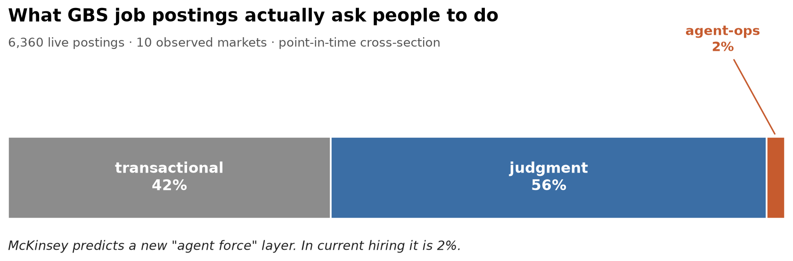

# Results

**Generated:** 2026-10-01  **Scope:** live Adzuna postings, point-in-time cross-section

Cross-section of **6360** labelled live GBS / finance-operations postings (adzuna/ch, adzuna/de, adzuna/es, adzuna/gb, adzuna/in, adzuna/mx, adzuna/nl, adzuna/pl, adzuna/sg, adzuna/za), pulled from the sources shown. Point-in-time, not a trend.

## Family mix

| family | postings |
|---|---|
| transactional | 2642 (42%) |
| judgment | 3569 (56%) |
| agent_ops | 149 (2%) |

Excludes **115** postings from advisory firms (consultancies selling GBS advice rather than performing GBS work). Third-party BPO delivery is kept in — it is the same work, outsourced — and broken out below.

## By market type

Delivery hubs and high-cost retained markets are different populations. Pooling them makes the headline partly a statement about the country basket, so the split is reported rather than averaged away.

| market type | postings | transactional | judgment | agent_ops |
|---|---|---|---|---|
| delivery (low-cost delivery hubs) | 3136 | 51% | 47% | 1.6% |
| retained (high-cost, HQ / process ownership) | 2207 | 33% | 64% | 3.2% |
| mixed (regional HQ alongside nearshore delivery) | 1017 | 31% | 66% | 2.9% |

## By organisation type

| organisation | postings | transactional | judgment | agent_ops |
|---|---|---|---|---|
| captive (in-house GBS) | 5676 | 37% | 61% | 2.4% |
| bpo (third-party delivery) | 684 | 79% | 18% | 2.2% |

## By seniority (title-inferred, crude)

| seniority | transactional | judgment | agent_ops |
|---|---|---|---|
| junior | 187 | 83 | 7 |
| mid/unknown | 1805 | 1551 | 77 |
| senior | 650 | 1935 | 65 |

## Method transparency

- 4265 labelled by the deterministic taxonomy, 2095 by the LLM fallback.
- LLM fallback share among included postings: 33%.
- 1649 postings were labelled `none` and excluded from the family mix.
- 0 fetched postings remain unlabelled and are excluded from this report.
- Agent-ops audit: 4 clear, 4 borderline, 3 likely false positives, 3 duplicate rows.
- Taxonomy gold-set accuracy: 66.7% (n=60).
- Gold-set agent_ops recall: 42.9%; the agent_ops share should be treated as a lower-bound signal until recall improves.
- Confidence split: agent_ops precision is strong, but the transactional-vs-judgment mix is exploratory at 66.7% overall accuracy.
- Sensitivity illustration: correcting the observed 149 agent_ops labels for the measured recall gives approximately 5.5%; this is an upper-bound diagnostic, not a new point estimate.

## Country cut

| source / country | family | postings |
|---|---|---|
| adzuna / ch | judgment | 152 |
| adzuna / ch | transactional | 34 |
| adzuna / ch | agent_ops | 16 |
| adzuna / de | judgment | 491 |
| adzuna / de | transactional | 202 |
| adzuna / de | agent_ops | 26 |
| adzuna / es | judgment | 249 |
| adzuna / es | transactional | 163 |
| adzuna / es | agent_ops | 21 |
| adzuna / gb | judgment | 594 |
| adzuna / gb | transactional | 380 |
| adzuna / gb | agent_ops | 24 |
| adzuna / in | transactional | 784 |
| adzuna / in | judgment | 505 |
| adzuna / in | agent_ops | 15 |
| adzuna / mx | judgment | 247 |
| adzuna / mx | transactional | 205 |
| adzuna / mx | agent_ops | 11 |
| adzuna / nl | judgment | 173 |
| adzuna / nl | transactional | 111 |
| adzuna / nl | agent_ops | 4 |
| adzuna / pl | judgment | 415 |
| adzuna / pl | transactional | 335 |
| adzuna / pl | agent_ops | 16 |
| adzuna / sg | judgment | 424 |
| adzuna / sg | transactional | 152 |
| adzuna / sg | agent_ops | 8 |
| adzuna / za | judgment | 319 |
| adzuna / za | transactional | 276 |
| adzuna / za | agent_ops | 8 |

- Gold-set detail: `python -m eval.eval_classify` prints the confusion matrix and per-family metrics.
- Seniority is inferred from title keywords only — treat as directional.
